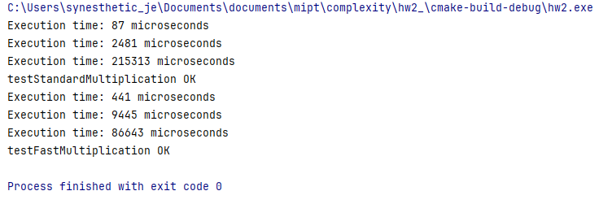

## Алгоритм умножения больших целых чисел

### Part 1

Стандартная реализация алгоритма умножения целых чисел ($standardMultiplication.h$) имеет временную сложность 
$O(n &times m) \approx O(n^2)$, где $n$ и $m$ — количество разрядов в каждом из входных чисел. Это связано с тем, что 
сложность основной части алгоритма умножения представляет собой два вложенных цикла, каждый из которых выполняет $m$ и $n$ 
итераций соответственно. Извлечение значений из вектора и конкатенация результата имеют равные сложности $O(n + m)$. 

В файле $fastMultiplication.h$ приведена реализация [метода Карацубы](https://www.mathnet.ru/links/1f3a55a7be51b84f82d04b979a328b3e/tm947.pdf).
Сложность данного алгоритма составляет $\theta (n^{log_2{3}})$.

**Объяснение**: В приведенной реализации происходит 3 рекурсивных вызова для умножения чисел, длина которых составляет $n/2$.
Следовательно, получается соотношение $3T(n/2)$, где $T(n)$ — время, необходимое для умножения чисел длиной $n$. Использование
функций, отвечающих за операции $add$ и $subtract$, добавляет сложность $O(n)$. Использование параллелизма не изменяет 
временной сложности. Следовательно, $T(n) = 3T(n/2) + O(n)$. Используя основную теорему о рекуррентных соотношениях, 
получаем $\theta (n^{log_2{3}})$.

- **Оценка параллелизма:**
$$ Parallelism = \frac{Work}{Span}$$, где $Work$ — это общее количество операций, которые должно выполнить вычисление, 
$Span$ — это длина самой длинной последовательности операций, которые не могут выполняться параллельно. 

**Стандартный метод:** $Work = \theta (n^2)$, $Span = \theta (n^2)$, т.к. операции идут последовательно и алгоритм не параллелизуем $=> Parallelism = 1$.

**Метод Карацубы:**
Поскольку $Span$ определяется длиной рекурсии, то по реализованному алгоритму $Span = \theta (log \, n)$, где $n$ — 
разрядность входных значений. Это связано с тем, что  на каждом уровне рекурсии числа делятся на две равные части, 
следовательно, глубина рекурсии равна количеству таких делений. Также на каждом уровне рекурсии выполняются вспомогательные
операции, такие как $addToBuffer$ и $subtract$. Это операции, выполняемые за $O(n)$, но они параллелизуемы, и, следовательно,
не увеличивают значение $Span$.

Следовательно, $ Parallelism = \frac{Work}{Span} = \frac{\theta(n^{log_2{3}})}{\theta(log \, n)} = \theta (\frac {n^{log_2{3}}}{log \, n})$

### Part 2
**Реальные эффекты масштабирования**

*Picture 1 —  Сравнение времени выполнения тестов*

В случае, когда разрядность входных данных равна 65, то есть достаточно мала, время выполнения при стандартной реализации и при помощи
метода Карацубы приблизительно равна $87$ и $441$ $\mu s$ соответственно. Промежуточные данные, когда разрядность составляет 
500 время выполнения стандартного алгоритма также превышает время выполнения метода Карацубы. Он становится эффективным на достаточно
больших входных данных, так как его ассимпотическое преимущество начинает перекрывать накладные расходы, такие как,
расходы на работу с потоками (временные и ресурсные), расходы на работу с рекурсией и т.д. При разрядности входных данных,
оценивающейся в 5000, время выполнения распределяется следующим образом: стандартный метод выполняется за $215313$ $\mu s$,
метод Карацубы за $86643$ $\mu s$ при одинаковых входных данных. 

**Вывод:**  
Эффективность параллелизации падает при малых $n$;  
При фиксированном количестве потоков с увеличением числа разрядности во входных данных алгоритм Карацубы становится 
эффективнее почти в 2.5 раза.
